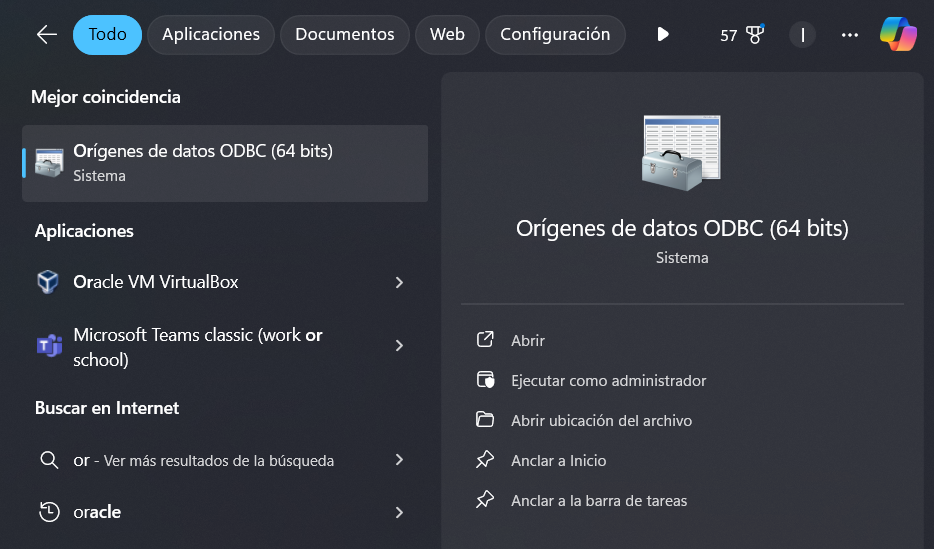
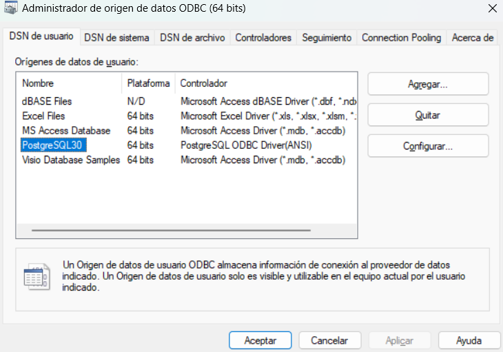
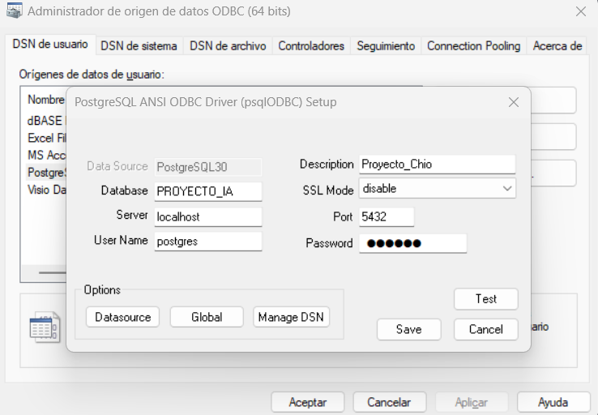

# APIs REST con Prolog y PostgreSQL

Este repo contiene un conjunto de **APIs REST** construidas con **FastAPI**. Las APIs están diseñadas para hacer consultas a reglas en **Prolog**, las cuales interactúan con una base de datos **PostgreSQL** a través de **SQLAlchemy** y **psycopg2**.

## Requisitos

Necesitarás tener instalado **PostgreSQL**,  **ODBC**, **SWIPL** y los siguientes paquetes para python:

```bash
pip install fastapi
pip install uvicorn
pip install SQLAlchemy
pip install psycopg2
pip install pyswip
```

Modifica el archivo "rules_prolog.pl" para añadir tu origen de datos ODBC, si no tienes uno para PostgreSQL lo puedes añadir, por lo general tendrá este nombre para los orígenes que son de PostgreSQL **PostgreSQL30**, esto lo escribirás en "tu_origen_de_datos" en el archivo "rules_prolog.pl", también modifica el archivo "connection.py" con tus credenciales.

Abres este programa:




Si no tienes algo como PostgreSQL30, seleccionas agregar




Le pasas tus credenciales a tu nueva interfaz y guardas





Deberías tener algo como esto en la regla para hacer la conexión:

%%%%%%%%%%%%%%%%%%%%%%%%%%%%%%%%%%%%%%%%%%%%%%%%

% CONEXION

:- use_module(library(odbc)).

% Conectarse a la base de datos

connect_db(Connection) :-

odbc_connect('PostgreSQL30', Connection, [user('tu_usuario'), password('tu_contraseña'), alias(my_db), open(once)]).
  
%%%%%%%%%%%%%%%%%%%%%%%%%%%%%%%%%%%%%%%%%%%%%%%%

## Ejecutar el proyecto

```bash
uvicorn main:app --reload
```

> Algunas partes sobre la conexion de prolog con postgresql se obtuvieron de este video:
[video inentendible](https://www.youtube.com/watch?v=A3gm8JE9nBg&t=645s)


>NOTA: Yo se que es una tontería usar prolog para obtener datos de postgresql cuando prolog no esta especificamente pensado para eso, pero así me lo exigieron